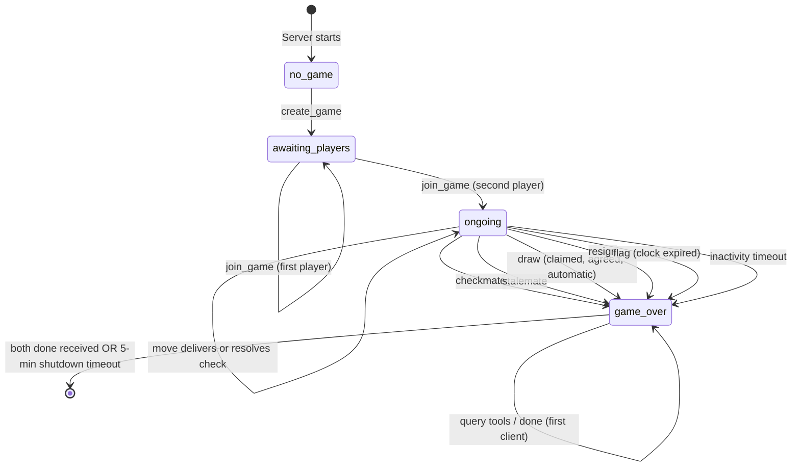

# Chess Engine Specification

**Version 0.1.0** — This specification is versioned. Implementations should note which
version they target. Future versions may add features (e.g., client reconnection,
multiple concurrent games) while maintaining backward compatibility where possible.

This document is the authoritative specification for chess engine implementations used in
N-version cross-validation. It is language-independent and implementation-independent. Any
conforming implementation must produce identical results for the same inputs on all
behaviors defined here.

Terminology follows standard chess usage. "Must", "must not", and "shall" indicate
mandatory requirements. "Should" indicates a recommendation. "May" indicates an option.

---

## Table of Contents

1. [Board and Coordinate System](#1-board-and-coordinate-system)
2. [Piece Movement Rules](#2-piece-movement-rules)
3. [Check, Checkmate, and Stalemate](#3-check-checkmate-and-stalemate)
4. [Draw Conditions](#4-draw-conditions)
5. [FEN Representation](#5-fen-representation)
6. [Algebraic Notation](#6-algebraic-notation)
7. [Game Lifecycle](#7-game-lifecycle)
8. [MCP Tool Interface](#8-mcp-tool-interface)
9. [Test Vectors](#9-test-vectors)

---

## 1. Board and Coordinate System

### 1.1 Square Identification

The board consists of 64 squares arranged in an 8x8 grid. Each square is identified by a
file letter (`a`-`h`) and a rank digit (`1`-`8`).

- **Files** run vertically. File `a` is the leftmost column from White's perspective;
  file `h` is the rightmost.
- **Ranks** run horizontally. Rank `1` is White's back rank (bottom); rank `8` is Black's
  back rank (top).
- A square is written as its file letter followed by its rank digit: `e4`, `a1`, `h8`.

Files are indexed 0-7 (`a`=0, `h`=7). Ranks are indexed 0-7 (`1`=0, `8`=7). A square's
color is dark if `(file_index + rank_index)` is even, light if odd. Square `a1` is dark.

### 1.2 Initial Position

The standard starting position places 32 pieces as follows:

| Rank | Contents (file a through h)               |
|------|-------------------------------------------|
| 8    | r  n  b  q  k  b  n  r  (Black)          |
| 7    | p  p  p  p  p  p  p  p  (Black pawns)    |
| 6    | (empty)                                   |
| 5    | (empty)                                   |
| 4    | (empty)                                   |
| 3    | (empty)                                   |
| 2    | P  P  P  P  P  P  P  P  (White pawns)    |
| 1    | R  N  B  Q  K  B  N  R  (White)          |

The initial position in FEN (see [Section 5](#5-fen-representation)):

```
rnbqkbnr/pppppppp/8/8/8/8/PPPPPPPP/RNBQKBNR w KQkq - 0 1
```

The White queen starts on a light square (`d1`); the Black queen starts on a dark square
(`d8`). Each queen starts on a square matching its own color.

---

## 2. Piece Movement Rules

### 2.1 General Rules

**2.1.1** A move relocates exactly one piece from a source square to a destination square.
Castling is the sole exception: it moves both the king and a rook (see
[Section 2.7.3](#273-castling)).

**2.1.2** A piece must not move to the square it currently occupies (no null moves).

**2.1.3** A piece must not move to a square occupied by a friendly piece.

**2.1.4 Capturing.** If an enemy piece occupies the destination square, it is removed from
the board and the moving piece takes its place. En passant is a special case where the
captured piece is not on the destination square (see [Section 2.2.5](#225-en-passant)).

**2.1.5 Legality constraint.** A move is legal if and only if, after the move is fully
executed — including all side effects (capture removal, en passant removal, rook movement
in castling, pawn replacement in promotion) — the moving player's own king is not in check
(see [Section 3](#3-check-checkmate-and-stalemate)).

### 2.2 Pawn

#### 2.2.1 Direction

White pawns advance toward rank 8 (increasing rank). Black pawns advance toward rank 1
(decreasing rank). Pawns never move backward or sideways.

#### 2.2.2 Single Push

A pawn may advance one square forward to an empty square.

**Preconditions:** The square one rank ahead (in the pawn's direction) is empty.

**Postconditions:** The pawn occupies the destination square. No en passant target square
is set.

#### 2.2.3 Double Push

A pawn on its starting rank may advance two squares forward, provided both the
intermediate square and the destination square are empty.

**Preconditions:**
- The pawn is on its starting rank (rank 2 for White, rank 7 for Black).
- The square one rank ahead is empty.
- The square two ranks ahead is empty.

**Postconditions:**
- The pawn occupies the destination square (two ranks ahead).
- The en passant target square is set to the intermediate square (the square the pawn
  passed over). This target square is always recorded in the FEN regardless of whether
  any enemy pawn is in position to capture en passant (see [Section 5.1](#51-format),
  field 4). However, for position identity in repetition detection, the en passant
  target is only relevant when a legal capture exists (see [Section 4.3](#43-threefold-repetition)).

#### 2.2.4 Diagonal Capture

A pawn may move one square diagonally forward (one rank ahead, one file left or right)
to capture an enemy piece on that square.

**Preconditions:** An enemy piece occupies the destination square.

**Postconditions:** The enemy piece is removed. The pawn occupies the destination square.

Note: a pawn does not attack or move to the square directly in front of it by capture. A
pawn's attack squares are exclusively the two diagonal-forward squares.

#### 2.2.5 En Passant

When an enemy pawn has just advanced two squares (double push), a pawn on the same rank
and an adjacent file may capture it "in passing."

**Preconditions:**
- The opponent's immediately preceding move was a pawn double push.
- The capturing pawn is on the same rank as the enemy pawn that just double-pushed.
- The capturing pawn is on an adjacent file to the enemy pawn.
- Equivalently: the en passant target square (set by the double push) is the capturing
  pawn's diagonal-forward square.

**Postconditions:**
- The capturing pawn moves to the en passant target square (the square the enemy pawn
  passed over).
- The enemy pawn is removed from the board (it is on the capturing pawn's original rank,
  not on the destination square).

**Expiry:** En passant is available only on the half-move immediately following the double
push. If not exercised, the opportunity is lost.

**Important edge case — horizontal pin:** When evaluating whether an en passant capture is
legal under rule 2.1.5, both the capturing pawn and the captured pawn must be considered
removed from their original squares. If the capturing pawn and captured pawn are on the
same rank as the friendly king, and removing both reveals a horizontal attack (by an enemy
rook or queen) on the king, the en passant capture is illegal. Implementations must
correctly handle this case.

#### 2.2.6 Promotion

When a pawn reaches the back rank (rank 8 for White, rank 1 for Black), it must
immediately be replaced by a piece of the same color chosen by the player: queen, rook,
bishop, or knight. Promotion is mandatory; a pawn cannot remain a pawn on the back rank. Promotion to a
king or pawn is illegal.

Promotion may occur on a straight push or a diagonal capture (including en passant, though
en passant to the back rank is geometrically impossible in standard chess since it requires
the capturing pawn to be on rank 5 or 4).

The promoted piece is a new piece. There is no limit on the number of pieces of a given
type (e.g., a player may have multiple queens).

### 2.3 Knight

#### 2.3.1 Movement

A knight moves in an L-shape: two squares along one axis (rank or file) and one square
along the perpendicular axis, or equivalently, one square along one axis and two along the
other. This yields up to 8 destination squares from any position.

#### 2.3.2 Jumping

A knight is the only piece that may jump over other pieces. Intervening pieces do not
block its movement.

#### 2.3.3 Boundary

Destination squares that fall outside the 8x8 board are unavailable. A knight in a corner
has 2 legal destinations (before applying rule 2.1.3 and 2.1.5); a knight on the edge has
3 or 4.

### 2.4 Bishop

#### 2.4.1 Movement

A bishop moves any number of squares along a diagonal (both rank and file change by the
same amount in each step).

#### 2.4.2 Path Obstruction

All squares between the source and destination (exclusive) must be empty. A bishop may
capture an enemy piece on the destination square.

#### 2.4.3 Color Binding

A consequence of diagonal movement is that a bishop always remains on squares of the same
color it started on. This is an invariant that can be used for validation but is not a rule
that needs separate enforcement.

### 2.5 Rook

#### 2.5.1 Movement

A rook moves any number of squares along a rank (horizontal) or file (vertical).

#### 2.5.2 Path Obstruction

All squares between the source and destination (exclusive) must be empty. A rook may
capture an enemy piece on the destination square.

#### 2.5.3 Castling Rights

Moving a rook forfeits the castling right associated with that rook's starting square (see
[Section 2.7.3](#273-castling)). This applies only to the specific rook that moved, not to
the other rook.

### 2.6 Queen

#### 2.6.1 Movement

A queen combines the movement of a rook and a bishop: it may move any number of squares
along a rank, file, or diagonal.

#### 2.6.2 Path Obstruction

All squares between the source and destination (exclusive) must be empty. A queen may
capture an enemy piece on the destination square.

The set of legal destinations for a queen on a given square is exactly the union of the
legal destinations for a rook and a bishop on that same square, given the same board state.

### 2.7 King

#### 2.7.1 Normal Movement

A king may move one square in any of the 8 directions (horizontal, vertical, or diagonal).

#### 2.7.2 Restriction

A king must not move to a square that is attacked by any enemy piece (see [Section
3.1](#31-attack)). This is a consequence of rule 2.1.5 (the move would leave the king in
check).

#### 2.7.3 Castling

Castling is a special move involving the king and one rook. There are two types:

- **Kingside castling:** The king moves two squares toward the h-file rook; the rook
  moves to the square the king crossed. White: king `e1`->`g1`, rook `h1`->`f1`. Black:
  king `e8`->`g8`, rook `h8`->`f8`.
- **Queenside castling:** The king moves two squares toward the a-file rook; the rook
  moves to the square the king crossed. White: king `e1`->`c1`, rook `a1`->`d1`. Black:
  king `e8`->`c8`, rook `a8`->`d8`.

**Preconditions (all must hold):**

1. The king has not previously moved in this game.
2. The rook involved has not previously moved in this game.
3. All squares between the king and the rook are empty. For kingside: one intervening
   square (f-file) plus the king's destination (g-file). For queenside: two intervening
   squares (b-file and c-file) plus the rook's destination (d-file). That is, for
   queenside castling, the b-file square must also be empty.
4. The king is not currently in check.
5. The king does not pass through a square attacked by an enemy piece. For kingside: the
   f-file square. For queenside: the d-file square.
6. The king does not land on a square attacked by an enemy piece. For kingside: the
   g-file square. For queenside: the c-file square.

**Squares that need NOT be unattacked:**
- The rook's starting square (the rook may be "under attack").
- For queenside castling, the b-file square (the rook passes through it, but the king
  does not).

**Postconditions:**
- The king and rook occupy their new squares.
- Both the king-side and queen-side castling rights for that color are forfeited (since the
  king has moved).

**Castling rights as independent state:** Castling rights are not derivable from piece
positions alone. They must be tracked as separate boolean flags. Castling rights are lost
when:
- The king moves (both sides forfeit).
- A rook moves from its starting square (that side forfeits).
- A rook is captured on its starting square (that side forfeits). This case is easy to
  overlook: if White captures the rook on `a8`, Black's queenside castling right is lost
  even though the Black rook never moved.

---

## 3. Check, Checkmate, and Stalemate

### 3.1 Attack

A piece **attacks** a square if it could move to that square considering only geometric
movement rules and path obstruction, but ignoring the legality constraint of rule 2.1.5.
That is, a piece attacks a square even if moving there would leave its own king in check
(the piece is pinned).

Special cases:
- A pawn attacks the two diagonal-forward squares, regardless of whether those squares are
  occupied. A pawn does **not** attack the square directly in front of it.
- A king attacks all 8 adjacent squares (within the board), regardless of whether those
  squares are also attacked by enemy pieces.
- For sliding pieces (bishop, rook, queen), a piece attacks squares along its lines of
  movement up to and including the first occupied square in each direction.

**A pinned piece still gives check.** If a piece is pinned against its own king, it
nonetheless attacks all the squares it geometrically reaches. If one of those squares
contains the enemy king, the enemy king is in check. The fact that the pinned piece
cannot legally move does not affect whether it attacks squares. (See [Test Vector
9.1.1](#911-pinned-piece-gives-check).)

### 3.2 Check

A king is **in check** if it is attacked by at least one enemy piece.

When in check, the player whose king is in check must make a move that resolves the check.
A move resolves check by one of:
- Moving the king to a square that is not attacked.
- Capturing the attacking piece (if exactly one piece gives check).
- Blocking the line of attack by interposing a piece between the attacker and the king
  (if the attacker is a sliding piece and exactly one piece gives check).

**Double check:** When two enemy pieces simultaneously attack the king, only a king move
can resolve the check — blocking or capturing can address at most one attacker.

### 3.3 Checkmate

The side to move is in checkmate if:
1. Their king is in check, AND
2. They have no legal moves.

Checkmate ends the game. The side that delivered checkmate (the side that just moved) wins.

### 3.4 Stalemate

The side to move is in stalemate if:
1. Their king is **not** in check, AND
2. They have no legal moves.

Stalemate ends the game as a draw.

Stalemate can arise even when the stalemated side has many pieces on the board — if every
piece is either pinned, blocked, or would expose the king to check by moving.

Common stalemate patterns that implementations must handle correctly:
- Lone king with no legal moves (all adjacent squares attacked or occupied by friendly
  pieces).
- King with pawns, but all pawns are blocked and the king has no legal moves.
- Pieces that can geometrically move but are all pinned against the king, and the king
  itself has no legal moves. (See [Test Vector 9.2](#92-stalemate).)

---

## 4. Draw Conditions

### 4.1 Stalemate

See [Section 3.4](#34-stalemate). Stalemate is an automatic draw; no claim is required.

### 4.2 Fifty-Move Rule

If 50 consecutive moves by each side (100 half-moves) occur with no pawn move and no
capture, the fifty-move condition is met.

**Halfmove clock:** A counter that tracks half-moves since the last pawn move or capture.
It is incremented by 1 after each half-move that is not a pawn move and does not involve
a capture. It is reset to 0 on any pawn move or any capture (including en passant
captures, which are both pawn moves and captures).

**Claim-based draw:** When the halfmove clock reaches 100 (after a move), the player
to move may claim a draw. The engine must report when this condition is met.

**Automatic draw at 75 moves:** Per FIDE rules (2014), if 75 consecutive moves by each
side (150 half-moves) occur with no pawn move and no capture, the game is automatically
drawn — no claim required. If the 75th move delivers checkmate, checkmate takes priority.

### 4.3 Threefold Repetition

If the same position occurs three times during the game (not necessarily on consecutive
moves), the repetition condition is met.

**Position identity.** Two positions are the same if and only if all of the following
match (per FIDE Article 9.2.3 — "the possible moves of all the pieces of both players
are the same"):
1. The same pieces of the same colors occupy the same squares.
2. The same side is to move.
3. The same castling rights are available (all four flags: K, Q, k, q).
4. The en passant state is the same. An en passant target square is considered part of
   the position only if a **fully legal** en passant capture exists — that is, an enemy
   pawn is adjacent on the correct rank **and** it can legally execute the capture
   (accounting for pins and check). If no legal en passant capture exists, the en passant
   target square is ignored for position identity even if it is recorded in the FEN (see
   [Section 5.1](#51-format), field 4).

Note: FEN field 4 always records the en passant target square after a double push,
regardless of whether a legal capture exists (see [Section 2.2.3](#223-double-push)).
This is a serialization convention. Position identity for repetition detection is
stricter — it considers the en passant target only when it actually affects the set of
legal moves.

**Claim-based draw:** When the third occurrence is reached, the player to move may claim
a draw. The engine must report when this condition is met.

**Automatic draw at fivefold repetition:** Per FIDE rules (2014), if the same position
occurs five times, the game is automatically drawn — no claim required. If the fifth
occurrence results from a move that delivers checkmate, checkmate takes priority.

**Implementation note:** Positions should be compared using a hash or canonical
representation. The en passant legality check for position identity requires generating
and testing the en passant capture for legality (including the horizontal pin case from
[Section 2.2.5](#225-en-passant)). A simple approach is to include the en passant file
in the position hash only when `has_legal_en_passant()` returns true. FEN alone
(without the halfmove clock and fullmove number fields) is **not** sufficient as a
position key because it always records the en passant target regardless of legality.

### 4.4 Insufficient Material

The following material combinations make checkmate impossible by any sequence of legal
moves:
- King vs. King
- King + Bishop vs. King
- King + Knight vs. King
- King + Bishop vs. King + Bishop, where both bishops are on the same color square

This list is exhaustive. The engine must report insufficient material for exactly these
four material combinations and no others.

**Advisory status:** The engine must report insufficient material as a queryable status.
It is not an automatic game termination — the game may continue if the players choose
(e.g., to reach a move count or for other reasons).

**Not insufficient material:** King + Knight + Knight vs. King is **not** insufficient
(checkmate is possible with opponent cooperation). King + Bishop vs. King + Bishop with
opposite-colored bishops is not insufficient.

### 4.5 Termination Priority

If a move simultaneously satisfies multiple conditions (e.g., delivers checkmate while
also reaching the 75-move threshold), the following priority applies:

1. **Checkmate** — always takes priority. The game is decisive.
2. **Stalemate** — draw.
3. **Automatic draw conditions** (75-move, fivefold repetition) — draw.
4. **Claimable draw conditions** (50-move, threefold repetition) — engine reports; game
   continues unless claimed.

---

## 5. FEN Representation

### 5.1 Format

A FEN (Forsyth-Edwards Notation) string consists of six space-separated fields:

**Field 1 — Piece placement.** Ranks 8 through 1 (top to bottom from White's
perspective), separated by `/`. Within each rank, pieces are denoted by single letters:

| Letter | Piece        |
|--------|--------------|
| K / k  | King         |
| Q / q  | Queen        |
| R / r  | Rook         |
| B / b  | Bishop       |
| N / n  | Knight       |
| P / p  | Pawn         |

Uppercase = White. Lowercase = Black. Consecutive empty squares are represented by a
digit `1`-`8` indicating the count. Digits and piece letters within a rank are
concatenated without separators.

Examples:
- `rnbqkbnr` — all 8 squares occupied (Black back rank).
- `8` — all 8 squares empty.
- `4P3` — 4 empty squares, a White pawn, 3 empty squares.

**Field 2 — Active color.** `w` (White to move) or `b` (Black to move).

**Field 3 — Castling availability.** A combination of the characters `K`, `Q`, `k`, `q`
indicating which castling moves are still available:
- `K` — White kingside.
- `Q` — White queenside.
- `k` — Black kingside.
- `q` — Black queenside.
- `-` — no castling available for either side.

Characters must appear in the order `KQkq`. Absent rights are omitted (e.g., `Kq` means
White kingside and Black queenside are available).

**Field 4 — En passant target square.** If the last move was a pawn double push, this is
the square "behind" the pawn (the square it passed over), in lowercase algebraic notation
(e.g., `e3`). If no en passant is possible, this is `-`.

The en passant target square is recorded whenever a double push occurs, regardless of
whether any enemy pawn is in position to capture en passant.

**Field 5 — Halfmove clock.** The number of half-moves since the last pawn move or
capture. A non-negative integer. Used for the fifty-move rule.

**Field 6 — Fullmove number.** Starts at `1` and is incremented after each Black move.
A positive integer.

### 5.2 Serialization Rules

When serializing a position to FEN:
- Empty squares within a rank are merged into the longest possible runs. A rank with
  squares empty-empty-piece-empty is written as `2P1` (not `11P1`).
- The maximum digit in a run is `8` (an entirely empty rank).
- No leading zeros in the halfmove clock or fullmove number.
- Castling flags appear in the fixed order `KQkq`, with absent rights omitted.
- The en passant square, if present, uses lowercase file and rank digit.

### 5.3 Deserialization

A conforming implementation must accept any valid FEN string and reconstruct the full
game state.

A conforming implementation must reject invalid FEN with a descriptive error. Invalid
FEN includes but is not limited to:
- Wrong number of fields (not exactly 6).
- Wrong number of ranks (not exactly 8 `/`-separated segments in field 1).
- Rank with more than 8 squares (piece letters + digit values exceed 8).
- Consecutive digits within a rank (e.g., `44` instead of `8`). Empty squares must be
  represented as a single merged digit.
- Invalid piece letter.
- Active color not `w` or `b`.
- Invalid castling characters.
- Invalid en passant square.
- Negative or non-integer halfmove clock or fullmove number.
- Fullmove number less than 1.

The implementation should also validate the position itself:
- Exactly one White king and one Black king.
- No pawns on rank 1 or rank 8 (they would have promoted).
- No more than 16 pieces per side. No more than 8 pawns per side.
- The side **not** to move must not be in check (this would mean the side to move made
  an illegal move that failed to resolve check, or delivered check and then passed the
  turn — neither is possible in a legal game).
- The two kings must not be on adjacent squares (the one that moved there would have
  moved into check, which is illegal).
- Castling rights are consistent with king/rook positions (e.g., if White claims kingside
  castling, there should be a White king on e1 and a White rook on h1). However, this
  validation is advisory — FEN strings from external sources (e.g., chess databases) may
  represent composed positions that violate these constraints.

### 5.4 Round-Trip Invariant

For any canonical FEN string `f`:

```
serialize(deserialize(f)) == f
```

The canonical form is defined by the serialization rules in [Section 5.2](#52-serialization-rules).

---

## 6. Algebraic Notation

### 6.1 Long Algebraic Notation (LAN)

Long algebraic notation unambiguously identifies a move by specifying both the source and
destination squares.

**Format:** `<source><destination>[<promotion>]`

- Source and destination are square names in lowercase: `e2e4`, `g1f3`.
- Promotion is indicated by appending the promoted piece type in lowercase: `e7e8q`
  (pawn promotes to queen).
- Castling is encoded as the king's movement: `e1g1` (White kingside), `e1c1` (White
  queenside), `e8g8` (Black kingside), `e8c8` (Black queenside).

**Input strictness:** A conforming implementation must accept only canonical LAN on
input: lowercase letters, no hyphens, no extra characters. Non-canonical forms (e.g.,
`e2-e4`, `E2E4`) must be rejected with a descriptive error.

**Uniqueness:** Every legal move has exactly one canonical LAN representation. LAN is
the recommended format for cross-validation comparisons.

### 6.2 Standard Algebraic Notation (SAN)

Standard algebraic notation is the conventional human-readable notation used in chess
literature and PGN files.

#### 6.2.1 Piece Identifier

Non-pawn pieces are prefixed by an uppercase letter: `K` (king), `Q` (queen), `R` (rook),
`B` (bishop), `N` (knight). Pawn moves have no piece prefix.

#### 6.2.2 Destination Square

The destination square is always included, in lowercase algebraic notation.

#### 6.2.3 Capture Indicator

The character `x` is placed between the piece identifier (or disambiguation, or pawn
source file) and the destination square to indicate a capture: `Nxe5`, `exd5`.

#### 6.2.4 Disambiguation

When two or more pieces of the same type can reach the same destination square, the source
square is partially specified to distinguish them. Disambiguation is determined by
**geometric reachability** — whether the piece could reach the destination square
considering only movement rules and path obstruction, ignoring the legality constraint of
rule 2.1.5 (pins). This matches the FIDE standard and PGN specification.

Use the minimum disambiguation needed, applying these rules in order:
1. If the source file uniquely identifies the piece among all same-type pieces that can
   reach the destination, add the source file letter: `Rae1`.
2. If the source file is not sufficient (two or more of the candidate pieces share a
   file) but the source rank uniquely identifies the piece, add the source rank digit:
   `R1e1`.
3. If neither file nor rank alone is sufficient (possible with three or more pieces of
   the same type after promotions — e.g., queens on a1, a5, and e1 all reaching a3),
   add both file and rank: `Qa1a3`.

The disambiguation characters are placed between the piece letter and the capture
indicator or destination square.

#### 6.2.5 Pawn Moves

- **Non-capturing push:** Destination square only: `e4`, `d3`.
- **Capture:** Source file + `x` + destination square: `exd5`, `axb3`.
- **En passant:** Same format as a pawn capture. No special suffix is required.
- **Promotion:** Append `=` followed by the uppercase promoted piece letter: `e8=Q`,
  `bxa1=N`. The `=` separator is mandatory in SAN (distinguishing it from LAN).

#### 6.2.6 Castling

- **Kingside:** `O-O` (uppercase letter O, not digit zero).
- **Queenside:** `O-O-O`.

On input, implementations must accept only the canonical forms `O-O` and `O-O-O`
(uppercase letter O). Digit-zero variants (`0-0`, `0-0-0`) must be rejected. On output,
the canonical form uses uppercase letter O.

#### 6.2.7 Check and Checkmate Suffixes

- Append `+` if the move places the opponent's king in check: `Nf7+`.
- Append `#` if the move delivers checkmate: `Qh7#`.
- These suffixes are mandatory in the canonical output form.

#### 6.2.8 Input Strictness

A conforming implementation must accept only canonical SAN on input:
- Piece letters must be uppercase (`N`, not `n`).
- File letters and destination squares must be lowercase.
- The `x` capture indicator must be present for captures and absent for non-captures.
- Check (`+`) and checkmate (`#`) suffixes are **optional** on input but **mandatory**
  on output. An input move without the suffix is accepted if it is otherwise valid;
  an input move with an incorrect suffix (e.g., `+` when the move does not give check)
  must be rejected.
- Promotion must use `=` followed by an uppercase piece letter (`=Q`, not `=q` or `Q`).
- No extra whitespace or characters.
- Non-canonical forms must be rejected with a descriptive error.

#### 6.2.9 Uniqueness

Every legal move in a given position has exactly one canonical SAN representation,
determined by applying the above rules.

### 6.3 SAN Normalization

When loading games from external sources (e.g., PGN files, game databases), move strings
may contain annotations and stylistic variations that are not part of canonical SAN. A
conforming implementation must provide a normalization function that converts annotated
SAN into canonical SAN suitable for the engine's strict input parser.

#### 6.3.1 Annotation Stripping

The following suffixes may appear after a SAN move and must be stripped during
normalization:

**Move assessment glyphs** (appended after check/checkmate suffixes, if present):
- `!` — good move
- `?` — poor move / mistake
- `!!` — brilliant move
- `??` — blunder
- `!?` — interesting / speculative move
- `?!` — dubious move

**Numeric Annotation Glyphs (NAGs):** PGN uses `$` followed by a non-negative integer
(e.g., `$1` for good move, `$2` for mistake, `$6` for dubious). NAGs are typically
separated from the move by whitespace in PGN movetext and should be stripped.

Normalization must strip these annotations without altering the core move. For example,
`Nf3!` becomes `Nf3`, `Bxh7+??` becomes `Bxh7+`, `O-O!!` becomes `O-O`.

#### 6.3.2 Castling Normalization

Digit-zero castling variants must be converted to the canonical letter-O form:
- `0-0` → `O-O`
- `0-0-0` → `O-O-O`

#### 6.3.3 Check/Checkmate Suffix Normalization

Check and checkmate suffixes are optional on input to the engine (see [Section
6.2.8](#628-input-strictness)). During normalization, existing `+` and `#` suffixes
should be preserved if present but are not added. The engine will validate correctness
when the move is submitted.

#### 6.3.4 Normalization Pipeline

The recommended normalization order is:
1. Strip NAGs (remove `$` followed by digits).
2. Strip move assessment glyphs (`!!`, `??`, `!?`, `?!`, `!`, `?` — match longest
   first to avoid partial stripping).
3. Convert digit-zero castling to letter-O castling.
4. Strip leading/trailing whitespace.

The resulting string should be valid input for the engine's strict SAN parser. If
normalization produces a string that the parser still rejects, the original move string
is malformed beyond what normalization can repair, and a descriptive error should be
reported.

---

## 7. Game Lifecycle

### 7.1 Game Creation

A game may be created in two ways:

- **From the initial position:** The standard starting position with White to move.
  Equivalent to the FEN in [Section 1.2](#12-initial-position).
- **From a FEN string:** An arbitrary valid position. The engine sets up the board,
  active color, castling rights, en passant target, halfmove clock, and fullmove number
  from the FEN fields.

### 7.2 Turn Order

White moves first. Turns alternate strictly: White, Black, White, Black, and so on. A
player may only move pieces of their own color.

A rejected move (illegal move attempt) does not change the turn or any game state.

### 7.3 Move Execution

When a legal move is submitted:

1. **Board update.** The piece is moved from its source to its destination. Side effects
   are applied:
   - **Capture:** The captured piece is removed.
   - **En passant:** The enemy pawn is removed from its square (on the capturing pawn's
     original rank).
   - **Castling:** The rook is moved to its destination square.
   - **Promotion:** The pawn is replaced by the chosen piece.

2. **State update.** The following game state is updated after the board update:
   - **Active color:** Flipped to the other side.
   - **Castling rights:** Revoked as necessary (king moved, rook moved, or rook captured
     on its starting square).
   - **En passant target square:** Set if the move was a pawn double push (see [Section
     2.2.3](#223-double-push)); cleared to none otherwise.
   - **Halfmove clock:** Reset to 0 if the move was a pawn move or a capture; incremented
     by 1 otherwise.
   - **Fullmove number:** Incremented by 1 if Black just moved.

3. **Record.** The move is appended to the game's move history.

### 7.4 Game Status

After each move, the engine must be able to report the game status:

- **Ongoing:** The game continues. The side to move has at least one legal move.
- **Check:** The side to move is in check but has at least one legal move (subset of
  ongoing; the game continues).
- **Checkmate:** The side to move is in check and has no legal moves. The game is over;
  the other side wins.
- **Stalemate:** The side to move is not in check and has no legal moves. The game is
  over; draw.
- **Draw (fifty-move):** The halfmove clock has reached the claimable (100) or automatic
  (150) threshold.
- **Draw (repetition):** The current position has occurred the third (claimable) or fifth
  (automatic) time.
- **Insufficient material (advisory):** Neither side has sufficient material to deliver
  checkmate. This is a queryable flag, not a game-ending status (see [Section
  4.4](#44-insufficient-material)). The game continues unless a draw is claimed, agreed,
  or the game ends by other means.

### 7.5 Game Termination

The game ends when any of the following occurs:
- Checkmate is detected (see [Section 3.3](#33-checkmate)).
- Stalemate is detected (see [Section 3.4](#34-stalemate)).
- An automatic draw condition is met (75-move rule or fivefold repetition) and checkmate
  has not occurred on that move.
- A player claims a draw under the fifty-move rule or threefold repetition, and the claim
  is valid.
- A player resigns.

### 7.6 Post-Move Query

After each successful move, the engine must be able to provide on request:
- The updated FEN string for the current position.
- The current game status (from [Section 7.4](#74-game-status)).
- Whether the side to move is currently in check.
- The list of all legal moves for the side to move (in both LAN and SAN).
- The move history (all moves played so far, in SAN).

---

## 8. MCP Tool Interface

This section defines the MCP (Model Context Protocol) server interface that both
implementations must expose. The test harness sends identical MCP requests to both
implementations and compares responses field-by-field.

### 8.1 Transport and Sessions

The server uses **Streamable HTTP** transport on localhost. Two independent clients
(players) connect to the same server, each identified by the `Mcp-Session-Id` header.

Each session is in one of these roles:
- **Unjoined** — connected but has not joined a game. Can only use game management tools.
- **Player (White/Black)** — joined with a color. Full access to query and action tools.
- **Spectator** — joined as observer. Access to query tools except `get_messages`. No
  access to action tools.

### 8.2 Server States

The server maintains a single state machine governing the game and server lifecycle.



**State descriptions:**

- **`no_game`**: Server is running but no game exists. Only `create_game` is available.
  If `create_game` is called with an invalid FEN or history, the server remains in
  `no_game` (see [Section 8.5.1, `create_game`](#create_game) for validation rules).
- **`awaiting_players`**: A game has been created but fewer than two players have joined.
  Query tools work for spectators and the first player. Action tools are unavailable.
- **`ongoing`**: Game is in progress. All tools available per role and turn rules. Check
  is not a separate server state — it is reflected in the `is_check` field of
  `get_status`.
- **`game_over`**: Terminal state. Clients can still use query tools (`get_status`,
  `get_history`, `get_board`) and must each send a `done` message when finished. The
  server shuts down after both `done` messages are received or 5 minutes after game end,
  whichever is sooner.

**Transitions from `game_over`:** A new `create_game` is not supported after game over.
The server is single-use: one game per server instance.

### 8.3 Inactivity and Shutdown

#### 8.3.1 Inactivity Timeout

During an `ongoing` game, the server monitors client activity. If the server has not
received any tool call from **either** client for 10 consecutive minutes, the game ends
as a draw due to inactivity.

Clients shall send at least one tool call every 10 minutes to avoid the timeout. A
frequency of approximately once per minute is recommended to prevent timing issues and
game delays. A `get_status` call counts as activity.

The inactivity timeout is independent of the chess clock. A timed game may end by flag
(clock expiry) before the inactivity timeout, or by inactivity timeout in an untimed
game.

#### 8.3.2 Server Shutdown

After the game enters the `game_over` state (by any means — checkmate, draw, resign,
flag, inactivity), the server remains running to allow clients to query the final game
state. Shutdown occurs when:

1. Both clients have sent `done`, OR
2. 5 minutes have elapsed since the game ended.

Whichever comes first. After shutdown, the server process terminates and no further
tool calls are accepted.

### 8.4 Move Input Parsing

When a move string is submitted via `make_move`, the server applies the following
parsing pipeline:

1. **SAN normalization** — Apply the normalization rules from [Section
   6.3](#63-san-normalization) (strip annotations, convert digit-zero castling, trim
   whitespace).
2. **SAN parse** — Attempt to parse the normalized string as canonical SAN per [Section
   6.2](#62-standard-algebraic-notation-san). If successful, resolve to a legal move.
3. **LAN fallback** — If SAN parsing fails, attempt to parse the original string as
   canonical LAN per [Section 6.1](#61-long-algebraic-notation-lan). If successful,
   resolve to a legal move.
4. **Reject** — If both fail, return an `invalid_format` error.

There are no ambiguities between canonical SAN and canonical LAN: SAN uses piece
prefixes (`Nf3`) or bare destinations for pawns (`e4`), while LAN always has a
4-or-5-character source-destination format (`g1f3`, `e2e4`). Castling in SAN (`O-O`) is
syntactically distinct from LAN (`e1g1`).

### 8.5 Tool Definitions

Each tool is defined with its parameters (JSON Schema), response schema, preconditions,
and error codes.

#### 8.5.1 Game Management Tools

Available to any connected session regardless of role.

##### `create_game`

Creates a new game. Only valid in the `no_game` state.

If a `fen` parameter is provided, the server validates it per [Section
5.3](#53-deserialization) — both syntactic validity (field count, rank structure, piece
letters, etc.) and position validity (one king per side, no pawns on back ranks, side
not to move not in check, kings not adjacent, etc.). An invalid FEN is rejected with
`invalid_fen` and the server remains in `no_game`.

If `history` is provided, each move is replayed sequentially from the starting position
(either the standard initial position or the custom FEN if both are provided). Both
`fen` and `history` may be specified together — the game begins from the FEN and the
history is replayed on top of it. If any move in the history is illegal in its position,
the game is not created and `invalid_history` is returned.

**Parameters:**

```json
{
  "type": "object",
  "properties": {
    "fen": {
      "type": "string",
      "description": "Starting position in FEN. Default: standard initial position."
    },
    "history": {
      "type": "array",
      "items": { "type": "string" },
      "description": "Move history to replay from the starting position. Each move is parsed per Section 8.4 (SAN with normalization, LAN fallback)."
    },
    "white_name": {
      "type": "string",
      "description": "Display name for the White player. May be overridden by join_game."
    },
    "black_name": {
      "type": "string",
      "description": "Display name for the Black player. May be overridden by join_game."
    },
    "time_control": {
      "description": "Chess clock configuration. Omit for untimed games. See Section 8.7.2 for schema.",
      "type": "object"
    }
  },
  "additionalProperties": false
}
```

**Response:**

```json
{
  "game_id": "string (see Section 8.9 for generation rules)",
  "fen": "string (position after history replay, if provided)",
  "game_status": "awaiting_players",
  "time_control": "object | null (echoes back the time_control input, or null if untimed)"
}
```

**Errors:**

| Code | Condition |
|------|-----------|
| `invalid_fen` | FEN string is malformed or represents an invalid position. |
| `invalid_history` | A move in the history is illegal in its position. |
| `wrong_state` | Server is not in `no_game` state. |

##### `join_game`

Claims a seat in the active game.

**Parameters:**

```json
{
  "type": "object",
  "properties": {
    "color": {
      "type": "string",
      "enum": ["white", "black", "random", "spectator"],
      "description": "Requested role."
    },
    "name": {
      "type": "string",
      "description": "Player display name."
    }
  },
  "required": ["color"],
  "additionalProperties": false
}
```

**Player names:** If `name` is provided in `join_game`, it overrides any `white_name` or
`black_name` set in `create_game` for that color.

**Random color assignment:** Both players may join with `"random"`. When both have
submitted `"random"`, the server assigns colors deterministically in seeded mode (see
[Section 8.9.2](#892-game-id-generation)) or randomly in normal mode. If only one
player submits `"random"` and the other picks a specific color, the random player gets
the remaining color. If both pick the same specific color, the second request fails.

**Response:**

```json
{
  "assigned_color": "white | black | spectator",
  "game_status": "awaiting_players | ongoing"
}
```

The `game_status` transitions to `ongoing` when the second player joins.

**Errors:**

| Code | Condition |
|------|-----------|
| `no_active_game` | No game has been created. |
| `color_taken` | The requested color is already claimed. |
| `already_joined` | This session has already joined. |

##### `export_game`

Returns the current game in the requested format. Available in any state except
`no_game` (including `awaiting_players`, `ongoing`, and `game_over`). The server
returns the serialized content directly; it does not write to the filesystem.

**Parameters:**

```json
{
  "type": "object",
  "properties": {
    "format": {
      "type": "string",
      "enum": ["fen", "pgn"],
      "default": "pgn",
      "description": "'fen' returns position only; 'pgn' returns the full game."
    }
  },
  "additionalProperties": false
}
```

**PGN output format:** The seven required tag pairs per the PGN standard (Event, Site,
Date, Round, White, Black, Result) plus TimeControl. SAN movetext with clock annotations
in the `{[%clk h:mm:ss.s]}` format after each move, where time is truncated to tenths
of a second from the millisecond-precision internal value. Hours are not zero-padded;
minutes and seconds are zero-padded to two digits. Examples: `{[%clk 1:30:00.0]}`,
`{[%clk 0:04:59.5]}`. No NAGs, variations, or comments.

**Response:**

```json
{
  "content": "string (FEN string or PGN text)"
}
```

**Errors:**

| Code | Condition |
|------|-----------|
| `no_active_game` | No game exists. |

##### `done`

Signals that this client is finished with the game. Only valid in the `game_over` state.
After both clients send `done`, the server shuts down.

**Parameters:** None.

**Response:**

```json
{
  "acknowledged": true,
  "clients_remaining": "integer (number of clients that have not yet sent done)"
}
```

**Errors:**

| Code | Condition |
|------|-----------|
| `game_not_over` | The game is still in progress. |
| `already_done` | This client has already sent `done`. |

#### 8.5.2 Query Tools

Available to any joined session. `get_messages` is restricted from spectators.

##### `get_board`

Returns the current board position as a FEN string. Visual board rendering (ASCII, Unicode,
etc.) is a client concern and is not part of the server interface.

**Parameters:** None.

**Response:**

```json
{
  "fen": "string"
}
```

**Errors:**

| Code | Condition |
|------|-----------|
| `no_active_game` | No game exists. |
| `not_joined` | Session has not joined the game. |

##### `get_status`

Returns the current game status. This is the primary tool for polling game state.

**Parameters:** None.

**Response:**

All fields are always present. Fields that are not applicable in the current state use
`null` (for nullable types) or their type's zero value (`false` for booleans, `0` for
integers).

```json
{
  "game_id": "string | null (null in no_game state)",
  "server_state": "no_game | awaiting_players | ongoing | game_over",
  "game_status": "string (see game_status values below)",
  "turn": "white | black | null (null in no_game / awaiting_players / game_over)",
  "fen": "string | null (null in no_game state)",
  "fullmove_number": "integer (FEN fullmove number, see Section 5.1 field 6)",
  "halfmove_clock": "integer (see Section 5.1 field 5)",
  "is_check": "boolean",
  "can_claim_draw": {
    "fifty_move": "boolean",
    "repetition": "boolean"
  },
  "insufficient_material": "boolean (advisory, see Section 4.4)",
  "draw_offered": "boolean (true if the opponent has offered a draw to this session)",
  "last_move": { "san": "string", "lan": "string" },
  "result": "1-0 | 0-1 | 1/2-1/2 | null",
  "termination_reason": "string | null (see normative strings below)",
  "clock": "object | null (see Section 8.7)"
}
```

**`game_status` values:**

| Value | Meaning |
|-------|---------|
| `"no_game"` | No game exists. |
| `"awaiting_players"` | Game created, waiting for two players. |
| `"ongoing"` | Game in progress, side to move is not in check. |
| `"check"` | Game in progress, side to move is in check. |
| `"checkmate"` | Game over — side to move is checkmated. |
| `"stalemate"` | Game over — draw by stalemate. |
| `"draw_fifty_move"` | Game over — draw claimed under fifty-move rule. |
| `"draw_repetition"` | Game over — draw claimed under threefold repetition. |
| `"draw_automatic_fifty"` | Game over — automatic draw, 75-move rule. |
| `"draw_automatic_repetition"` | Game over — automatic draw, fivefold repetition. |
| `"draw_agreement"` | Game over — draw by mutual agreement. |
| `"draw_inactivity"` | Game over — draw by inactivity timeout. |
| `"resigned"` | Game over — a player resigned. |
| `"flag"` | Game over — a player's clock expired. |
| `"flag_draw"` | Game over — clock expired but opponent has insufficient material; draw. |

The `server_state` field is derived from `game_status`: `"no_game"` maps to `no_game`;
`"awaiting_players"` maps to `awaiting_players`; `"ongoing"` and `"check"` map to
`ongoing`; all other values map to `game_over`.

**`draw_offered` field:** Always present as a boolean. `false` for sessions that have no
pending draw offer directed at them (including the offering player, spectators, and
sessions with no game). `true` only for the player who has received an offer.

**`last_move` field:** `null` when no moves have been played (including `no_game` and
`awaiting_players` states, or `ongoing` at the start of a game).

**Normative `termination_reason` strings:**

These strings are exact and must be identical across implementations for N-version
comparison. `{White}` and `{Black}` are replaced with the literal strings `"White"` or
`"Black"` as appropriate.

| `game_status` | `termination_reason` |
|---------------|---------------------|
| `checkmate` | `"Checkmate — {winner} wins"` |
| `stalemate` | `"Stalemate — draw"` |
| `draw_fifty_move` | `"Draw by fifty-move rule (claimed by {claimant})"` |
| `draw_repetition` | `"Draw by threefold repetition (claimed by {claimant})"` |
| `draw_automatic_fifty` | `"Draw by 75-move rule — automatic under FIDE rules"` |
| `draw_automatic_repetition` | `"Draw by fivefold repetition — automatic under FIDE rules"` |
| `draw_agreement` | `"Draw by agreement"` |
| `draw_inactivity` | `"Draw by inactivity — no client activity for 10 minutes"` |
| `resigned` | `"{resigner} resigns — {winner} wins"` |
| `flag` | `"{winner} wins on time — {loser}'s clock expired"` |
| `flag_draw` | `"Draw — {flagged}'s clock expired but {opponent} has insufficient material"` |

**Errors:**

| Code | Condition |
|------|-----------|
| `no_active_game` | No game exists (called in `no_game` state). |
| `not_joined` | Session has not joined the game. |

##### `get_legal_moves`

Returns all legal moves for the side to move.

**Parameters:**

```json
{
  "type": "object",
  "properties": {
    "square": {
      "type": "string",
      "description": "Filter to moves from this square (e.g., 'e2')."
    },
    "format": {
      "type": "string",
      "enum": ["san", "lan", "both"],
      "default": "both"
    }
  },
  "additionalProperties": false
}
```

**Response:**

```json
{
  "moves": [
    { "san": "string", "lan": "string" }
  ],
  "count": "integer"
}
```

When `format` is `"san"` or `"lan"`, each entry contains only that field.

**Ordering:** Moves must be sorted lexicographically by their LAN representation. This
ensures identical output across implementations for N-version comparison.

**Errors:**

| Code | Condition |
|------|-----------|
| `invalid_square` | The `square` parameter is not a valid square name. |
| `no_active_game` | No game exists. |
| `not_joined` | Session has not joined the game. |

##### `get_history`

Returns the move history.

**Parameters:**

```json
{
  "type": "object",
  "properties": {
    "format": {
      "type": "string",
      "enum": ["san", "lan", "both"],
      "default": "san"
    }
  },
  "additionalProperties": false
}
```

**Response:**

```json
{
  "moves": [
    {
      "move_number": "integer (fullmove number, matches FEN field 6 for first entry)",
      "white": { "san": "string", "lan": "string", "clock_ms": "integer | null" },
      "black": { "san": "string", "lan": "string", "clock_ms": "integer | null" }
    }
  ],
  "total_half_moves": "integer"
}
```

The `move_number` of the first entry matches the FEN fullmove number from game creation
(1 for the standard starting position, or the value from a custom FEN).

The `clock_ms` field records the player's remaining time in milliseconds after the move
was processed (including any Fischer increment or Bronstein delay). `null` for untimed
games.

The last entry may have `black` as `null` if White just moved.

**Errors:**

| Code | Condition |
|------|-----------|
| `no_active_game` | No game exists. |
| `not_joined` | Session has not joined the game. |

##### `get_messages`

Returns messages sent to this player. **Not available to spectators.**

**Parameters:**

```json
{
  "type": "object",
  "properties": {
    "clear": {
      "type": "boolean",
      "default": true,
      "description": "Clear messages after reading."
    }
  },
  "additionalProperties": false
}
```

**Response:**

```json
{
  "messages": [
    { "from": "white | black | server", "text": "string", "move_number": "integer" }
  ]
}
```

Messages with `from: "server"` are system messages (e.g., draw offers, game events).

**Errors:**

| Code | Condition |
|------|-----------|
| `spectator_not_allowed` | Spectators cannot read player messages. |
| `no_active_game` | No game exists. |
| `not_joined` | Session has not joined the game. |

#### 8.5.3 Action Tools

Action tools modify game state. Some are **turn-gated** (only the player to move may
use them), others are available to either player at any time. All action tools return:
- `game_over` error if the game has already ended.
- `not_joined` error if the session has not joined the game.
- `spectator_not_allowed` error if the session joined as a spectator.

##### `make_move`

Submit a move. **Turn-gated.**

**Parameters:**

```json
{
  "type": "object",
  "properties": {
    "move": {
      "type": "string",
      "description": "Move string, parsed per Section 8.4 (SAN with normalization, LAN fallback)."
    }
  },
  "required": ["move"],
  "additionalProperties": false
}
```

**Preconditions:**
- It must be this player's turn.
- The move must be legal.
- If the opponent has a pending draw offer, the player must explicitly accept or decline
  it before making a move. This prevents a race condition where a player could implicitly
  reject a draw offer without seeing it.

**Postconditions:**
- The move is applied to the board per [Section 7.3](#73-move-execution).
- Automatic draw conditions are checked (75-move rule, fivefold repetition). If met
  and the move did not deliver checkmate, the game ends as a draw (per [Section
  4.5](#45-termination-priority)).
- Any pending draw offer from the moving player is implicitly withdrawn.

**Response:** Same shape as `get_status`, plus:

```json
{
  "move_played": { "san": "string", "lan": "string" }
}
```

**Errors:**

| Code | Condition |
|------|-----------|
| `not_your_turn` | Session does not own the color to move. |
| `illegal_move` | Move is not legal in the current position. |
| `ambiguous_move` | SAN input matches multiple legal moves. |
| `invalid_format` | Move string could not be parsed as SAN or LAN. |
| `pending_draw_offer` | Opponent has a pending draw offer; must accept or decline first. |
| `game_over` | Game has already ended. |
| `not_joined` | Session has not joined as a player. |
| `spectator_not_allowed` | Spectators cannot make moves. |

##### `claim_draw`

Claim a draw under the fifty-move rule or threefold repetition. **Turn-gated.** Only
the player to move may claim, matching [Section 4.2](#42-fifty-move-rule) and [Section
4.3](#43-threefold-repetition).

**Parameters:** None.

**Postconditions:** If valid, the game ends as a draw. If both the fifty-move and
threefold repetition conditions are simultaneously met, the fifty-move rule takes
priority (the `game_status` is `"draw_fifty_move"`). This ensures deterministic behavior
for N-version comparison.

**Response:** Same shape as `get_status`.

**Errors:**

| Code | Condition |
|------|-----------|
| `not_your_turn` | Session does not own the color to move. |
| `draw_not_available` | Neither fifty-move nor threefold repetition conditions are met. |
| `game_over` | Game has already ended. |
| `not_joined` | Session has not joined as a player. |
| `spectator_not_allowed` | Spectators cannot claim draws. |

##### `offer_draw`

Offer a draw to the opponent. **Not turn-gated** — either player at any time.

**Parameters:** None.

**Postconditions:** A draw offer is recorded. The opponent sees it via the `draw_offered`
field in `get_status` and as a system message in `get_messages`.

**Response:**

```json
{
  "offered": true
}
```

**Errors:**

| Code | Condition |
|------|-----------|
| `already_offered` | A draw offer from this player is already pending. |
| `game_over` | Game has already ended. |
| `not_joined` | Session has not joined as a player. |
| `spectator_not_allowed` | Spectators cannot offer draws. |

##### `accept_draw`

Accept a pending draw offer. **Not turn-gated.**

**Parameters:** None.

**Postconditions:** The game ends as a draw by agreement.

**Response:** Same shape as `get_status`.

**Errors:**

| Code | Condition |
|------|-----------|
| `no_pending_offer` | No draw offer to accept. |
| `game_over` | Game has already ended. |
| `not_joined` | Session has not joined as a player. |
| `spectator_not_allowed` | Spectators cannot accept draws. |

##### `decline_draw`

Decline a pending draw offer. **Not turn-gated.**

**Parameters:** None.

**Response:**

```json
{
  "declined": true
}
```

**Errors:**

| Code | Condition |
|------|-----------|
| `no_pending_offer` | No draw offer to decline. |
| `game_over` | Game has already ended. |
| `not_joined` | Session has not joined as a player. |
| `spectator_not_allowed` | Spectators cannot decline draws. |

##### `resign`

Resign the game. **Not turn-gated** — either player at any time.

**Parameters:** None.

**Postconditions:** The game ends. The opponent wins.

**Response:** Same shape as `get_status`.

**Errors:**

| Code | Condition |
|------|-----------|
| `game_over` | Game has already ended. |
| `not_joined` | Session has not joined as a player. |
| `spectator_not_allowed` | Spectators cannot resign. |

##### `send_message`

Send a message to the opponent. **Not turn-gated.** Not available to spectators.

**Parameters:**

```json
{
  "type": "object",
  "properties": {
    "text": {
      "type": "string",
      "description": "Message text."
    }
  },
  "required": ["text"],
  "additionalProperties": false
}
```

**Response:**

```json
{
  "sent": true
}
```

**Errors:**

| Code | Condition |
|------|-----------|
| `spectator_not_allowed` | Spectators cannot send messages. |
| `game_over` | Game has already ended. |
| `not_joined` | Session has not joined as a player. |

### 8.6 Error Format

All errors are returned as MCP tool errors — that is, the `CallToolResult` must have
`isError` set to `true`, with the error details in a structured content object:

```json
{
  "error": "error_code",
  "message": "Human-readable description of the error."
}
```

The `error` field contains one of the error codes defined in the tool tables above, or
`internal_error` for unexpected server failures (e.g., a caught panic or unhandled
exception). For `internal_error`, the response includes an additional
implementation-defined `detail` field:

```json
{
  "error": "internal_error",
  "message": "An unexpected error occurred.",
  "detail": "implementation-defined context (e.g., stack trace, error type)"
}
```

The `message` field provides context (e.g., `"Illegal move: pawn on e2 cannot reach e5"`
for `illegal_move`). Error messages are informational and should not be parsed
programmatically — use the `error` code for control flow.

### 8.7 Chess Clock

The chess clock is managed by the MCP server, not the rules engine. It is optional —
games created without `time_control` are untimed.

#### 8.7.1 Clock Formats

| Format | `type` value | Description |
|--------|-------------|-------------|
| Sudden death | `"sudden_death"` | Fixed total time, no increment. |
| Fischer increment | `"fischer"` | Fixed total time + per-move increment added after each move. |
| Bronstein delay | `"bronstein"` | Fixed total time + per-move delay before clock ticks. Unused delay is not banked. |
| Multi-period | `"multi_period"` | Sequential time controls (e.g., 40 moves in 90 min, then 30 min sudden death). |

#### 8.7.2 Time Control Schema

**Simple formats (sudden death, Fischer, Bronstein):**

```json
{
  "type": "object",
  "properties": {
    "type": { "enum": ["sudden_death", "fischer", "bronstein"] },
    "initial_time_ms": { "type": "integer", "minimum": 1 },
    "increment_ms": { "type": "integer", "minimum": 0, "description": "Fischer increment or Bronstein delay. 0 for sudden death." }
  },
  "required": ["type", "initial_time_ms"]
}
```

**Multi-period:**

```json
{
  "type": "object",
  "properties": {
    "type": { "enum": ["multi_period"] },
    "periods": {
      "type": "array",
      "items": {
        "type": "object",
        "properties": {
          "moves": { "type": "integer", "minimum": 1, "description": "Number of moves in this period. Omit for the final period." },
          "type": { "enum": ["sudden_death", "fischer", "bronstein"] },
          "initial_time_ms": { "type": "integer", "minimum": 0, "description": "Time added at the start of this period." },
          "increment_ms": { "type": "integer", "minimum": 0 }
        },
        "required": ["type", "initial_time_ms"]
      },
      "minItems": 2
    }
  },
  "required": ["type", "periods"]
}
```

#### 8.7.3 Clock Behavior

- **White's clock start:** White's clock does not start until White submits their first
  move. Before White's first move, neither clock is running. This means White is not
  penalized for any delay between game creation and the first move.
- After White's first move, the clock for the next player starts ticking when it becomes
  their turn (after the opponent's move is processed).
- The clock stops when the player submits a move.
- **Think time calculation:** When a player submits a move, the server computes their
  think time as `max(0, (receive_timestamp - turn_start_timestamp) - elapsed_ms)`, where
  `receive_timestamp` is when the server received the move request, `turn_start_timestamp`
  is when the player's turn began, and `elapsed_ms` is the server's processing time for
  the request. This subtraction ensures that engine speed differences do not unfairly
  penalize a player. The player's remaining time is reduced by this think time.
- **Fischer increment:** The increment is added to the player's remaining time **after**
  their move is processed (after the think time deduction).
- **Bronstein delay:** The first N milliseconds of thinking time (where N = `increment_ms`)
  do not consume clock time. Only time beyond the delay counts against the player. If the
  player moves within the delay, no time is consumed. Unused delay is **not** banked.
- **Flag:** If a player's remaining time reaches zero, they lose on time — unless the
  opponent has insufficient material to checkmate (per [Section 4.4](#44-insufficient-material)),
  in which case the result is a draw.

#### 8.7.4 Multi-Period Transitions

- Periods are sequential. The first period applies from the start; subsequent periods
  begin when the per-player move count for the current period is reached. The `moves`
  field is a per-player count (e.g., `"moves": 40` means each side makes 40 moves in
  that period, matching standard chess tournament notation).
- **Time rollover:** Unused time from a completed period carries over. The next period's
  `initial_time_ms` is **added** to the remaining time.
- **Time expiry mid-period:** If a player's time reaches zero during any period, they
  lose on time (flag). There is no automatic advance to the next period.
- **Final period:** The last period in the list has no `moves` field — it applies for the
  remainder of the game. If the last period has a `moves` field, a further sudden-death
  period with zero additional time is implied (the player continues on whatever time
  remains).
- Each period may be any clock type (sudden death, Fischer, or Bronstein).

#### 8.7.5 Clock State in Responses

When a time control is active, `get_status` and `make_move` responses include a `clock`
object:

```json
{
  "clock": {
    "white_time_ms": "integer (remaining time)",
    "black_time_ms": "integer (remaining time)",
    "running_for": "white | black | null (null if game not started or over)",
    "current_period": "integer (1-indexed, for multi-period)",
    "moves_until_next_period": "integer | null",
    "time_control": "object (the active time control configuration)"
  }
}
```

All time values are integer milliseconds.

### 8.8 Recording Format

Every tool invocation is logged to a JSON-lines file for replay and N-version testing.

#### 8.8.1 Record Schema

Each line is a JSON object:

```json
{
  "ts_ms": "integer (Unix timestamp in milliseconds when the server received the request)",
  "session_id": "string (identifies which client made the call)",
  "tool": "string (tool name)",
  "params": "object (tool parameters as submitted)",
  "result": "object (full response including clock state)",
  "elapsed_ms": "integer (server processing time in milliseconds)"
}
```

**Key fields:**
- `ts_ms` — Used for deterministic clock replay. Both implementations compute clock
  state from recorded timestamps rather than real wall-clock time during replay.
- `elapsed_ms` — Server processing time (informational). Subtracted from the player's
  clock cost so that engine speed differences do not unfairly penalize a player.

#### 8.8.2 Game Boundary Markers

When the server starts a game, a boundary marker is written:

```json
{"ts_ms": 1710300000000, "type": "game_start", "game_id": "string", "fen": "string", "time_control": "object | null"}
```

When the game ends, an end marker is written:

```json
{"ts_ms": 1710300060000, "type": "game_end", "result": "1-0 | 0-1 | 1/2-1/2", "termination_reason": "string"}
```

#### 8.8.3 Replay Mode

The server can operate in replay mode where it reads from a recording file and validates
that each response matches the recorded response. Clock state is computed from the
recorded timestamps, ensuring deterministic comparison.

Disagreements between the replay response and the recorded response are logged with full
context (tool name, parameters, expected result, actual result, position FEN) for triage.

Replay configuration is implementation-defined (e.g., command-line flags). The recording
format and comparison semantics are normative; the replay invocation mechanism is not.

### 8.9 N-Version Comparison

This section defines rules for deterministic comparison of responses across
implementations.

#### 8.9.1 Deterministic Output

All tool responses must be fully deterministic given the same inputs and state. To
achieve this:

- **Legal moves** are sorted lexicographically by LAN (see `get_legal_moves`).
- **Termination reason strings** are normative (see `get_status`).
- **Move history** entries are ordered chronologically.
- **Messages** are ordered by receipt time.

#### 8.9.2 Game ID Generation

The `game_id` field is generated differently in normal and seeded modes:

- **Normal mode:** The server generates a unique identifier using any method
  (UUID, counter, etc.). The format is implementation-defined.
- **Seeded mode:** The server accepts a `--seed <integer>` flag (or equivalent
  configuration). When seeded, the `game_id` is the string `"game-1"` (incrementing
  for subsequent games if the spec is extended to support multiple games per server
  instance). Random color assignment is also deterministic: the seed determines the
  assignment via `seed % 2` (0 = first joiner gets White, 1 = first joiner gets Black).

For N-version comparison, both implementations must be started in seeded mode with the
same seed. The test harness compares all response fields including `game_id`.

#### 8.9.3 Elapsed Time in Seeded Mode

In seeded mode, `elapsed_ms` is fixed to `0` for all recording log entries and clock
calculations. This ensures that clock state (remaining time per player) is fully
deterministic across implementations regardless of processing speed differences. The
think time formula becomes simply `max(0, receive_timestamp - turn_start_timestamp)`.

#### 8.9.4 Fields Excluded from Comparison

When comparing responses across implementations in non-seeded mode, the following fields
should be excluded:

- `game_id` — non-deterministic in normal mode.
- `elapsed_ms` in recording logs — implementation-dependent processing time.
- `clock_ms` in responses and recording logs — affected by `elapsed_ms` differences.

All other fields, including `termination_reason`, are compared exactly.

The recommended approach for the test harness is to use seeded mode, making all fields
deterministic and fully comparable. If non-seeded comparison is needed, exclusion can be
implemented via a simple jq-style path list (e.g., `.game_id`, `.elapsed_ms`,
`.clock_ms`).

### 8.10 Client Disconnection

Client disconnection (HTTP session drop) is handled solely through the inactivity
timeout ([Section 8.3.1](#831-inactivity-timeout)). If a client disconnects mid-game,
the server continues running. If neither client sends any tool call for 10 minutes, the
game ends as a draw by inactivity.

Reconnection is not supported in this version of the specification. A disconnected
client cannot resume its session. **Future versions** may add session reconnection
semantics using MCP session resumption headers, allowing a client to reclaim its player
role after a transient disconnection.

---

## 9. Test Vectors

This section provides specific positions and expected results that any conforming
implementation must handle correctly. Each test vector includes a FEN position, a
board diagram, and the expected outcome.

### 9.1 Check

#### 9.1.1 Pinned Piece Gives Check

A piece that is pinned against its own king still attacks squares and can deliver check
to the enemy king. The definition of "attack" (Section 3.1) considers only geometric
reachability, not legality.

```
FEN: k7/8/8/8/r3K3/8/8/R7 w - - 0 1
```

```
8  k  .  .  .  .  .  .  .
7  .  .  .  .  .  .  .  .
6  .  .  .  .  .  .  .  .
5  .  .  .  .  .  .  .  .
4  r  .  .  .  K  .  .  .
3  .  .  .  .  .  .  .  .
2  .  .  .  .  .  .  .  .
1  R  .  .  .  .  .  .  .
   a  b  c  d  e  f  g  h
```

The Black rook on a4 is pinned along the a-file against the Black king on a8 by the
White rook on a1. If the Black rook moves off the a-file, the White rook would attack
the Black king along the a-file. However, the Black rook still **attacks** e4 along
rank 4, where the White king sits.

**Expected:** White is in check from the Black rook on a4. White's legal moves must
all resolve the check: king moves to d3, d5, e3, e5, f3, or f5 (but not d4 or f4,
which remain on rank 4 under the rook's attack), or Rxa4 capturing the checking piece.
The fact that the Black rook is pinned and cannot legally move off the a-file does not
prevent it from delivering check.

#### 9.1.2 Discovered Check

```
FEN: 4k3/8/4N3/8/8/8/8/4R2K w - - 0 1
```

```
8  .  .  .  .  k  .  .  .
7  .  .  .  .  .  .  .  .
6  .  .  .  .  N  .  .  .
5  .  .  .  .  .  .  .  .
4  .  .  .  .  .  .  .  .
3  .  .  .  .  .  .  .  .
2  .  .  .  .  .  .  .  .
1  .  .  .  .  R  .  .  K
   a  b  c  d  e  f  g  h
```

The White knight on e6 blocks the e-file between the White rook on e1 and the Black
king on e8. Any knight move from e6 uncovers the rook's attack along the e-file,
delivering discovered check.

**Expected:** After any White knight move from e6 (Nc5, Nc7, Nd4, Nd8, Nf4, Nf8, Ng5,
Ng7), Black is in check from the White rook on e1.

#### 9.1.3 Double Check

```
FEN: 5k2/8/8/8/5N2/8/8/5R1K w - - 0 1
```

```
8  .  .  .  .  .  k  .  .
7  .  .  .  .  .  .  .  .
6  .  .  .  .  .  .  .  .
5  .  .  .  .  .  .  .  .
4  .  .  .  .  .  N  .  .
3  .  .  .  .  .  .  .  .
2  .  .  .  .  .  .  .  .
1  .  .  .  .  .  R  .  K
   a  b  c  d  e  f  g  h
```

White plays Nf4-e6. The knight vacates f4, opening the f-file for the rook on f1 to
attack f8 (discovered check). The knight on e6 also attacks f8 (knight geometry:
e6 to f8 is +1 file, +2 ranks). Both pieces give check simultaneously.

**Expected:** After Ne6, Black is in double check. Only king moves are legal — blocking
or capturing can resolve at most one check. The knight on e6 attacks c5, c7, d4, d8,
f4, f8, g5, g7, so g7 is also attacked. Legal king moves for Black: e8, e7, g8.

#### 9.1.4 Pawn Does Not Give Check Forward

```
FEN: 8/8/8/4k3/4P3/8/8/4K3 w - - 0 1
```

```
8  .  .  .  .  .  .  .  .
7  .  .  .  .  .  .  .  .
6  .  .  .  .  .  .  .  .
5  .  .  .  .  k  .  .  .
4  .  .  .  .  P  .  .  .
3  .  .  .  .  .  .  .  .
2  .  .  .  .  .  .  .  .
1  .  .  .  .  K  .  .  .
   a  b  c  d  e  f  g  h
```

The White pawn on e4 is directly below the Black king on e5. A pawn attacks only the
two diagonal-forward squares (d5 and f5 for this pawn), not the square directly ahead.

**Expected:** Black is not in check. The pawn does not threaten e5.

### 9.2 Stalemate

#### 9.2.1 Lone King Stalemate

```
FEN: k7/2Q5/1K6/8/8/8/8/8 b - - 0 1
```

```
8  k  .  .  .  .  .  .  .
7  .  .  Q  .  .  .  .  .
6  .  K  .  .  .  .  .  .
5  .  .  .  .  .  .  .  .
4  .  .  .  .  .  .  .  .
3  .  .  .  .  .  .  .  .
2  .  .  .  .  .  .  .  .
1  .  .  .  .  .  .  .  .
   a  b  c  d  e  f  g  h
```

Black to move. The Black king on a8 is not in check. All adjacent squares are controlled:
a7 (queen along rank 7 + king), b8 (queen diagonal), b7 (queen + king). No legal moves.

**Expected:** Stalemate. Draw.

#### 9.2.2 Stalemate with Large Material Advantage

```
FEN: 5bnr/4p1pq/4Qpkr/4pPp1/4P1P1/8/8/2B1K2R b K - 0 1
```

```
8  .  .  .  .  .  b  n  r
7  .  .  .  .  p  .  p  q
6  .  .  .  .  Q  p  k  r
5  .  .  .  .  p  P  p  .
4  .  .  .  .  P  .  P  .
3  .  .  .  .  .  .  .  .
2  .  .  .  .  .  .  .  .
1  .  .  B  .  K  .  .  R
   a  b  c  d  e  f  g  h
```

Black to move. Despite having a queen, two rooks, a bishop, a knight, and five pawns,
Black has no legal moves. The king on g6 is not in check but has no safe squares. Every
other Black piece is blocked or pinned. All pawns are blocked.

**Expected:** Stalemate. Draw. Demonstrates that material advantage does not prevent
stalemate.

#### 9.2.3 Stalemate with Pawn Blockade

```
FEN: k7/P7/K7/8/8/8/8/8 b - - 0 1
```

```
8  k  .  .  .  .  .  .  .
7  P  .  .  .  .  .  .  .
6  K  .  .  .  .  .  .  .
5  .  .  .  .  .  .  .  .
4  .  .  .  .  .  .  .  .
3  .  .  .  .  .  .  .  .
2  .  .  .  .  .  .  .  .
1  .  .  .  .  .  .  .  .
   a  b  c  d  e  f  g  h
```

Black to move. Black king on a8, not in check. Available squares: b8 (attacked by pawn
a7 diagonally), a7 (occupied by White pawn), b7 (attacked by White king on a6). No legal
moves.

**Expected:** Stalemate. Draw.

#### 9.2.4 Not Stalemate — Pinned Piece Has Along-Pin Move

```
FEN: 4k3/4r3/8/8/8/8/8/4R1K1 b - - 0 1
```

```
8  .  .  .  .  k  .  .  .
7  .  .  .  .  r  .  .  .
6  .  .  .  .  .  .  .  .
5  .  .  .  .  .  .  .  .
4  .  .  .  .  .  .  .  .
3  .  .  .  .  .  .  .  .
2  .  .  .  .  .  .  .  .
1  .  .  .  .  R  .  K  .
   a  b  c  d  e  f  g  h
```

Black to move. The Black rook on e7 is pinned along the e-file by the White rook on e1.
However, the Black rook can still move along the e-file (e.g., Re7-e6, Re7-e2, Re7xe1).
The king also has moves (d8, f8, d7, f7).

**Expected:** Not stalemate. The pinned rook has legal along-pin moves, and the king
has legal moves. A piece pinned along a line can still move along that line.

### 9.3 En Passant

#### 9.3.1 En Passant Pin (Horizontal)

```
FEN: 8/8/8/8/k2Pp2R/8/8/4K3 b - d3 0 1
```

```
8  .  .  .  .  .  .  .  .
7  .  .  .  .  .  .  .  .
6  .  .  .  .  .  .  .  .
5  .  .  .  .  .  .  .  .
4  k  .  .  P  p  .  .  R
3  .  .  .  .  .  .  .  .
2  .  .  .  .  .  .  .  .
1  .  .  .  .  K  .  .  .
   a  b  c  d  e  f  g  h
```

Black to move. White just played d2-d4 (en passant target d3). The Black pawn on e4
could attempt exd3 en passant. If it did, both the Black pawn (from e4) and the White
pawn (from d4) would leave rank 4. This would open the line from the White rook on h4
to the Black king on a4, leaving the Black king in check.

**Expected:** The en passant capture exd3 is illegal. It would expose the Black king
on a4 to check from the White rook on h4 along rank 4. This is the "horizontal pin"
edge case described in Section 2.2.5 — both pawns must be considered removed when
checking legality.

### 9.4 Castling

#### 9.4.1 Queenside Castling with b-File Attacked

```
FEN: 1r2k3/8/8/8/8/8/8/R3K3 w Q - 0 1
```

```
8  .  r  .  .  k  .  .  .
7  .  .  .  .  .  .  .  .
6  .  .  .  .  .  .  .  .
5  .  .  .  .  .  .  .  .
4  .  .  .  .  .  .  .  .
3  .  .  .  .  .  .  .  .
2  .  .  .  .  .  .  .  .
1  R  .  .  .  K  .  .  .
   a  b  c  d  e  f  g  h
```

White to move. The Black rook on b8 attacks b1. For queenside castling (O-O-O), the
king moves e1->c1 and the rook moves a1->d1. The square b1 must be empty but need NOT
be unattacked — only the king's path matters (e1, d1, c1).

**Expected:** White queenside castling (O-O-O) is legal. The b1 square being attacked
does not prevent castling because the king never occupies or passes through b1.

#### 9.4.2 Castling Rights Lost on Rook Capture

```
FEN: r3k2r/8/8/8/8/8/8/R3K3 w Qkq - 0 1
```

```
8  r  .  .  .  k  .  .  r
7  .  .  .  .  .  .  .  .
6  .  .  .  .  .  .  .  .
5  .  .  .  .  .  .  .  .
4  .  .  .  .  .  .  .  .
3  .  .  .  .  .  .  .  .
2  .  .  .  .  .  .  .  .
1  R  .  .  .  K  .  .  .
   a  b  c  d  e  f  g  h
```

White plays Rxa8 (captures the Black rook on a8). This removes Black's queenside
castling right — the rook on a8 was captured on its starting square, even though it
never moved. White's queenside right is also removed because the a1 rook moved.

**Expected FEN after Rxa8+:** `R3k2r/8/8/8/8/8/8/4K3 b k - 0 1`. Only Black's
kingside castling right `k` remains.
